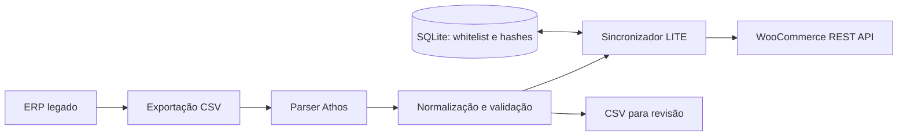

# Legacy ERP Stock Sync

Integra exportações de um ERP legado ao WooCommerce, normalizando CSV e sincronizando preço e estoque de produtos existentes. Desenvolvido para resolver um problema real de operação de varejo: conectar um ERP sem uma API adequada a uma loja virtual.

> Developed to solve a real production retail problem. A versão de portfólio preserva o código operacional e usa exemplos sintéticos; a execução nesta máquina não comprova o estado de uma instalação externa.

## Problema e solução

O ERP disponibilizava relatórios e CSVs, enquanto o e-commerce precisava de SKU, preço e saldo consistentes. Recriar todo o cadastro a cada exportação sobrescreveria descrições, imagens e trabalho editorial. O modo **LITE** usa uma whitelist local de SKUs e atualiza somente preço e estoque; hashes evitam escritas quando esses valores não mudaram.

## Funcionalidades implementadas

- Parser Athos para CSV delimitado por ponto e vírgula e relatórios CSV legados; rejeição de `.rpt` binário.
- Normalização de números brasileiros, identificadores, nomes, marcas e unidades; aviso para SKUs potencialmente arredondados por planilhas.
- Mapeamento de produtos existentes, whitelist e hashes em SQLite.
- Sincronização LITE, exportação para revisão e `--dry-run`.
- Modos FULL e LITE+IMG separados, com maior alcance de alteração.
- Dashboard FastAPI/Jinja, curadoria de imagens, logs e notificações opcionais.
- Scripts PowerShell para agendamento, lock de execução e diagnóstico.

## Arquitetura



Este repositório consome o CSV diretamente. A API de catálogo é um projeto separado: a cadeia `ERP → API → WooCommerce` não é uma dependência do LITE atual. Consulte [arquitetura e reutilização](docs/PORTFOLIO_ARCHITECTURE.md).

## Stack

Python, Pydantic/Pydantic Settings, SQLite, cliente WooCommerce, HTTPX/Requests, FastAPI, Jinja2, pytest e PowerShell. Docker Compose é uma alternativa de empacotamento; Redis não é requisito do fluxo implementado.

## Instalação e desenvolvimento

```powershell
py -m venv venv
.\venv\Scripts\python.exe -m pip install -r requirements.txt
Copy-Item .env.example .env
.\venv\Scripts\python.exe -m pytest
```

Edite `.env` com a configuração de uma loja de testes. O exemplo começa com sincronização desligada e simulação ligada. Não há credenciais incluídas.

| Configuração | Finalidade |
| --- | --- |
| `WOO_URL`, `WOO_CONSUMER_KEY`, `WOO_CONSUMER_SECRET` | Destino e autenticação WooCommerce |
| `INPUT_DIR`, `OUTPUT_DIR`, `DB_PATH` | Arquivos locais e whitelist |
| `SYNC_ENABLED`, `DRY_RUN` | Controle explícito de escrita |
| `PRICE_GUARD_MAX_VARIATION`, `ZERO_GHOST_STOCK` | Proteções de sincronização; manter zeragem global desligada |
| `APP_NAME`, `STORE_NAME` | Nome do sistema e loja nas superfícies configuráveis |
| `DISCORD_WEBHOOK_URL`, `TELEGRAM_WEBHOOK_URL` | Notificações opcionais |
| `DASHBOARD_AUTH_ENABLED`, `DASHBOARD_USERNAME`, `DASHBOARD_PASSWORD` | Acesso ao dashboard |

O inventário completo está em [.env.example](.env.example) e [config/settings.py](config/settings.py). Instalações existentes mantêm seu `.env`; revise os valores antes de adotar esta versão.

## Como funciona

Primeiro valide uma fixture sintética, sem ler um export comercial:

```powershell
.\venv\Scripts\python.exe scripts/profile_athos_export.py tests/fixtures/athos/athos-current-synthetic.csv --output data/output/profile.json
.\venv\Scripts\python.exe main.py --input tests/fixtures/athos/athos-current-synthetic.csv --lite --dry-run
```

Para uma integração autorizada, `main.py --map-site` consulta a loja configurada e preenche a whitelist local. `--lite` passa a atualizar produtos existentes quando a configuração permite escrita. FULL pode recriar conteúdo; não é substituto do LITE para a rotina de saldo e preço. O `--dry-run` pode gerar arquivos locais, mas não deve publicar alterações.

## Segurança e operação

Exports, relatórios comerciais, imagens de clientes, `.env`, bancos e logs ficam fora do Git. Notificações podem conter dados de produtos; use canais autorizados. O dashboard tem ações operacionais: configure autenticação antes de disponibilizá-lo em uma rede.

O agendador Windows é opcional e não é instalado pelo comando de testes. Scripts e nomes de tarefas legados são preservados para compatibilidade, conforme [limites da generalização](docs/PORTFOLIO_ARCHITECTURE.md). Runbooks antigos em `docs/` registram decisões históricas e precisam ser adaptados ao ambiente de destino.

## Casos de uso e status

Integração de varejistas com ERP sem API, atualização restrita de estoque/preço e preparação de importações revisáveis. O adapter implementado é Athos; outros layouts de ERP exigem adaptação e testes. Case de origem operacional real, em manutenção e preparação para portfólio. Não há métricas de impacto publicadas nesta auditoria.
