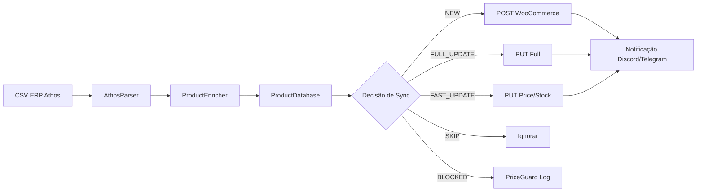

# 📋 Contexto do Projeto - AquaFlora Stock Sync

> **Documento de referência para desenvolvimento futuro**  
> Última atualização: Janeiro 2026

---

## 🎯 Visão Geral

**AquaFlora Stock Sync** é um sistema de sincronização inteligente de estoque que migra dados do **ERP Athos** para **WooCommerce**. O sistema foi desenvolvido para a loja AquaFlora Agroshop.

### Funcionalidades Principais

| Funcionalidade | Descrição |
|----------------|-----------|
| **Parser de CSV** | Lê arquivos "sujos" exportados do ERP Athos |
| **Enriquecimento** | Detecta marcas (160+), extrai peso, gera descrições SEO |
| **Sincronização** | Atualiza produtos via API WooCommerce com segurança |
| **Dashboard Web** | Interface visual para controle sem terminal |
| **Bot Discord** | Controle remoto via comandos Discord |
| **Notificações** | Relatórios via Discord/Telegram webhooks |

---

## 📁 Estrutura do Projeto

```
aquaflora-stock-sync/
├── main.py                 # Entry point principal (CLI)
├── bot_control.py          # Discord Bot 2.0
├── config/
│   ├── settings.py         # Pydantic Settings (carrega .env)
│   └── brands.json         # Cache editável de marcas (v2.1)
├── src/
│   ├── parser.py           # AthosParser - lê CSV do ERP
│   ├── enricher.py         # ProductEnricher - marca, peso, SEO
│   ├── database.py         # ProductDatabase - SQLite + price_history
│   ├── sync.py             # WooSyncManager - API WooCommerce
│   ├── notifications.py    # NotificationService - webhooks
│   ├── models.py           # Pydantic models + hashes
│   ├── exceptions.py       # Exceções customizadas (v2.1)
│   └── logging_config.py   # JSON/Color formatters (v2.1)
├── dashboard/
│   ├── app.py              # FastAPI + HTMX + APScheduler
│   ├── templates/          # Jinja2 templates
│   └── static/             # CSS responsivo + JS
├── tests/                  # Suite pytest (v2.1)
│   ├── conftest.py         # Fixtures
│   ├── test_parser.py
│   ├── test_enricher.py
│   ├── test_database.py
│   └── test_models.py
├── data/
│   ├── input/              # CSVs do ERP
│   └── output/             # CSVs gerados
├── logs/                   # Logs rotativos
├── products.db             # SQLite database
├── Dockerfile              # Deploy containerizado
├── docker-compose.yml      # Orquestração (dashboard + bot)
├── requirements.txt        # Dependências Python
├── pytest.ini              # Configuração de testes
├── COMANDOS.md             # Guia de comandos (v2.1)
├── .env                    # Credenciais (não versionado)
└── DEPLOY.md               # Guia de deploy Proxmox
```

---

## 🔧 Arquitetura e Pipeline



### Componentes Principais

#### 1. `parser.py` - AthosParser

**Responsabilidade:** Ler o CSV "sujo" exportado do ERP Athos.

- **Problema:** O ERP exporta um "relatório" com lixo (headers da empresa, paginação, totais)
- **Solução:** Detecta o marcador `"Valor Custo"` e extrai dados após ele
- **Conversão:** Números brasileiros (1.234,56) → float (1234.56)

```python
# Patterns de "lixo" filtrados
GARBAGE_PATTERNS = [
    r"^Total\s*(Venda|Custo):",
    r"Página\s*-?\d+\s*de\s*\d+",
    r"^Relatório\s*de\s*Estoque",
    ...
]
```

#### 2. `enricher.py` - ProductEnricher

**Responsabilidade:** Enriquecer produtos com SEO e metadados.

- **Detecção de Marcas:** 160+ marcas mapeadas (Royal Canin, Pedigree, NexGard, etc.)
- **Extração de Peso:** Regex para kg, g, ml, litros
- **Geração de Descrições:** HTML com emojis para WooCommerce
- **Correção de Nomes:** Title case + acentuação (racao → Ração)

```python
KNOWN_BRANDS = {
    'royal canin': 'Royal Canin',
    'nexgard': 'NexGard',
    'bravecto': 'Bravecto',
    # ... 160+ marcas
}
```

#### 3. `database.py` - ProductDatabase

**Responsabilidade:** Gerenciar estado de sincronização com SQLite.

**Tabela `products`:**
| Campo | Tipo | Descrição |
|-------|------|-----------|
| `sku` | TEXT PK | SKU do produto |
| `woo_id` | INTEGER | ID no WooCommerce |
| `last_hash_full` | TEXT | Hash de todos os campos |
| `last_hash_fast` | TEXT | Hash de preço+estoque |
| `last_price` | REAL | Último preço sincronizado |
| `exists_on_site` | INTEGER | Flag de whitelist |

**Whitelist:** Produtos mapeados via `--map-site` são marcados para sync seguro.

#### 4. `sync.py` - WooSyncManager

**Responsabilidade:** Sincronizar com API WooCommerce.

**Estratégias:**
- **Dual Hash:** `hash_full` detecta mudanças em nome/descrição, `hash_fast` apenas preço/estoque
- **PriceGuard:** Bloqueia variações > 40% (evita erros de digitação)
- **Batch Updates:** Atualiza até 100 produtos por request
- **Retry com Backoff:** 3 tentativas com delay exponencial

**Modos:**
| Modo | Flag | Comportamento |
|------|------|---------------|
| FULL | (default) | Atualiza todos os campos |
| LITE | `--lite` | **Apenas** preço e estoque |
| DRY RUN | `--dry-run` | Testa sem enviar |

#### 5. `notifications.py` - NotificationService

**Responsabilidade:** Enviar relatórios premium via webhooks.

- **Discord:** Embeds com logo, cores semafóricas, top 10 mudanças
- **Telegram:** Mensagem Markdown simples
- **Cores Semafóricas:** 🟢 Verde (sucesso), 🟡 Amarelo (warnings), 🔴 Vermelho (erros)

#### 6. `models.py` - Modelos Pydantic

**Modelos principais:**

| Modelo | Uso |
|--------|-----|
| `RawProduct` | Produto parseado do CSV |
| `EnrichedProduct` | Produto enriquecido com SEO |
| `WooPayloadFull` | Payload completo para API |
| `WooPayloadFast` | Payload mínimo (preço/estoque) |
| `SyncSummary` | Resultado da sincronização |
| `PriceWarning` | Produto bloqueado pelo PriceGuard |
| `ProductChange` | Mudança individual para relatório |

---

## 🖥️ Dashboard Web

**Tecnologia:** FastAPI + Jinja2 + HTMX

### Endpoints

| Rota | Método | Descrição |
|------|--------|-----------|
| `/` | GET | Página principal |
| `/api/status` | GET | Status atual |
| `/api/sync/run` | POST | Inicia sincronização |
| `/api/sync/upload` | POST | Upload de CSV |
| `/api/map-site` | POST | Mapeia whitelist |
| `/api/products` | GET | Últimas mudanças |
| `/partials/*` | GET | Fragmentos HTMX |

### Estado Global

```python
class AppState:
    is_syncing: bool = False
    last_sync: Optional[datetime] = None
    sync_status: str = "Idle"
    scheduler_enabled: bool = False
    scheduled_time: str = "11:00"
```

---

## 🤖 Discord Bot 2.0

**Tecnologia:** py-cord (discord.py fork)

### Comandos

| Comando | Descrição |
|---------|-----------|
| `!ajuda` | Menu visual de comandos |
| `!status` | Status atual do sistema |
| `!whitelist` | Estatísticas de SKUs mapeados |
| `!produtos` | Últimos 10 produtos alterados |
| `!precos` | Top 5 altas e quedas de preço |
| `!forcar_agora` | Força sync imediato |
| `!log` | Envia último arquivo de log |

---

## 🛡️ Camadas de Segurança

### 1. Whitelist de SKUs

- Por padrão, **NÃO cria** produtos novos
- Só atualiza SKUs mapeados via `--map-site`
- Flag `--allow-create` habilita criação

### 2. PriceGuard

- Bloqueia variações > 40%
- Evita erros de digitação no ERP
- Produtos bloqueados vão para relatório

### 3. Dual Hash Strategy

- `hash_full`: Mudanças em nome, descrição, atributos
- `hash_fast`: Mudanças apenas em preço e estoque
- Economiza API calls enviando só o necessário

### 4. Parser de Preços Inteligente

- Auto-detecta formato: Brasileiro (1.234,56) vs Americano (1,234.56)
- Evita erros de conversão de vírgula/ponto

---

## ⚙️ Configuração (.env)

```env
# WooCommerce API
WOO_URL=https://sualoja.com.br
WOO_CONSUMER_KEY=ck_xxxxx
WOO_CONSUMER_SECRET=cs_xxxxx

# Caminhos
INPUT_DIR=./data/input
OUTPUT_DIR=./data/output
DB_PATH=./products.db

# Segurança
PRICE_GUARD_MAX_VARIATION=40
ZERO_GHOST_STOCK=false  # CUIDADO!

# Notificações
DISCORD_WEBHOOK_URL=https://discord.com/api/webhooks/...
DISCORD_BOT_TOKEN=seu_token
DISCORD_CHANNEL_ID=seu_channel_id
```

---

## 🐳 Deploy com Docker

**Serviços:**
1. `dashboard` - FastAPI na porta 8080
2. `bot` - Discord Bot (depende do dashboard)

**Volumes persistentes:**
- `products.db` - Banco SQLite
- `logs/` - Logs rotativos
- `data/input/` - CSVs de entrada
- `data/output/` - CSVs gerados
- `last_run_stats.json` - Estatísticas para bot

---

## 🔴 Status das Melhorias (v2.1)

### ✅ Implementado

| Item | Status | Descrição |
|------|--------|-----------|
| Agendamento APScheduler | ✅ | `AsyncIOScheduler` integrado no dashboard |
| Testes automatizados | ✅ | ~50 testes com pytest |
| Tratamento de erros | ✅ | `WooCommerceError`, `ParserError` com retry inteligente |
| Dashboard autenticação | ✅ | HTTP Basic Auth configurável |
| Logs estruturados | ✅ | `JSONFormatter` para produção |
| Métricas/monitoring | ✅ | Endpoint `/metrics` |
| Whitelist automática | ✅ | Refresh semanal via scheduler |
| Descrições SEO | ✅ | Templates por categoria (Pet, Vet, Aquarismo, etc) |
| Interface mobile | ✅ | CSS responsivo (4 breakpoints) |
| Histórico de preços | ✅ | Tabela `price_history` no SQLite |
| Documentação API | ✅ | `/docs` (Swagger) e `/redoc` |
| Validação CSV | ✅ | ParserError com contexto de linha/arquivo |
| Cache de marcas | ✅ | `config/brands.json` editável |

### ⏸️ Pendente

| Item | Motivo |
|------|--------|
| Suporte multi-loja | Requer redesign do banco de dados |

---

## 📊 Dependências Principais

| Pacote | Versão | Uso |
|--------|--------|-----|
| `woocommerce` | ≥3.0.0 | API WooCommerce |
| `pydantic` | ≥2.0.0 | Validação de dados |
| `pydantic-settings` | ≥2.0.0 | Configuração via .env |
| `fastapi` | ≥0.104.0 | Dashboard web |
| `uvicorn` | ≥0.24.0 | ASGI server |
| `py-cord` | ≥2.4.0 | Discord bot |
| `httpx` | ≥0.25.0 | HTTP client async |
| `jinja2` | ≥3.1.0 | Templates |
| `apscheduler` | ≥3.10.0 | Agendamento (não usado ainda) |

---

## 📝 Convenções de Código

- **Linguagem:** Português (nomes de variáveis misturados pt/en)
- **Docstrings:** Inglês
- **Logs:** Português com emojis
- **Commits:** Não padronizado
- **Tipo de hints:** Sim (Python 3.9+)
- **Linter:** Nenhum configurado (recomendado: ruff ou black)

---

## 🔗 Referências Importantes

- **README.md** - Documentação para usuário final
- **DEPLOY.md** - Guia de deploy Proxmox/Docker
- **main.py** - Todos os modos de execução CLI
- **bot_control.py** - Comandos Discord disponíveis

---

> 💡 **Dica:** Para qualquer modificação, comece lendo este arquivo e os models em `src/models.py` para entender a estrutura de dados.
